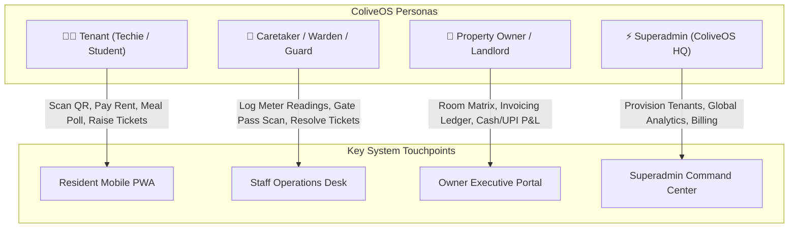
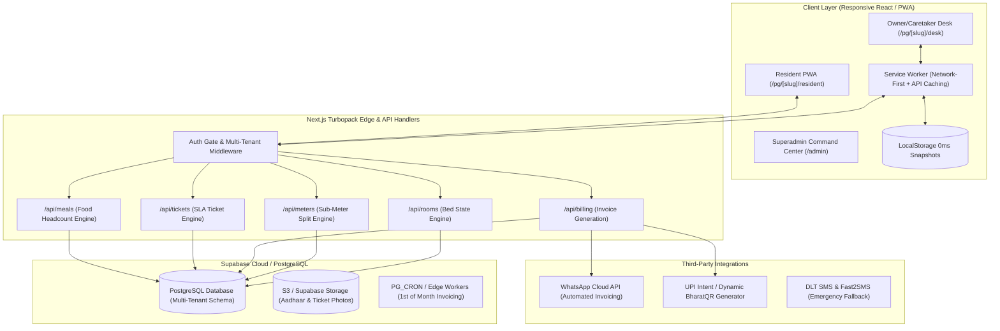
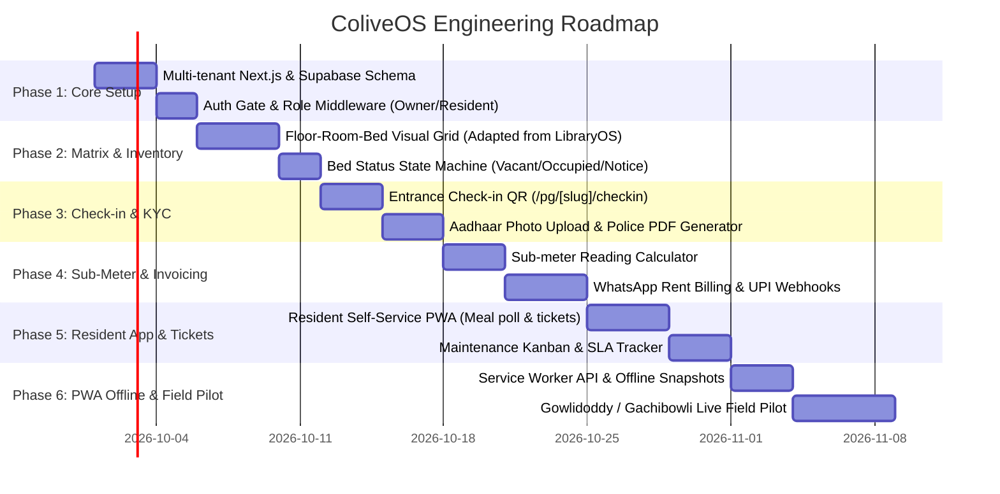

# 🏢 ColiveOS ("Stanza-in-a-Box") — Architectural Specification & Blueprint
> **A Multi-Tenant B2B Operating System for Independent PGs, Hostels, and Co-Living Spaces in India.**
> *Architected by leveraging the battle-tested, high-resilience foundations of LibraryOS.*

---

## 📑 Table of Contents
1. [Executive Summary & Project Vision](#1-executive-summary--project-vision)
2. [Market Opportunity & Unit Economics](#2-market-opportunity--unit-economics)
3. [Core Personas & User Journeys](#3-core-personas--user-journeys)
4. [Transferable Knowledge from LibraryOS](#4-transferable-knowledge-from-libraryos)
5. [Grand System Architecture](#5-grand-system-architecture)
6. [Complete Database Schema (PostgreSQL / Supabase)](#6-complete-database-schema-postgresql--supabase)
7. [The 6 Core Algorithmic & Operational Engines](#7-the-6-core-algorithmic--operational-engines)
8. [Step-by-Step Engineering Build Plan](#8-step-by-step-engineering-build-plan)
9. [Go-To-Market (GTM) Strategy for Hyderabad & Beyond](#9-go-to-market-gtm-strategy-for-hyderabad--beyond)

---

## 1. Executive Summary & Project Vision

### 1.1 The Problem
In top Indian tech and student corridors (Gowlidoddy, Gachibowli, Madhapur in Hyderabad; Koramangala, Marathahalli in Bangalore; Hinjewadi in Pune), there are tens of thousands of independent Paying Guest (PG) hostels. 

- **High Revenue, Zero Tech:** An average 100-bed PG collects **₹8,00,000 to ₹14,00,000 in monthly cash flow**.
- **The Stone-Age Reality:** They run their entire business on a **₹50 paper notebook**, unorganized WhatsApp messages, and manual cash handovers.
- **The Operational Bleed:**
  - **Ghost Beds & Confusion:** Not knowing which bed in Room 302 is vacant vs under notice.
  - **The Electricity Sub-Meter Nightmare:** Calculating `(Current Reading - Old Reading) * Rate` across 40 rooms and dividing among 2–3 roommates every month takes 2 to 3 days of manual calculation and creates constant tenant arguments.
  - **Rent Leakage & Deposit Disputes:** Tenants vanishing without 30-day notice; fights over security deposit deductions.
  - **Food Waste:** Cooks preparing food blindly for 100 people when only 65 are eating, wasting ₹20,000–₹35,000/month in groceries.
  - **Police Verification Risk:** Storing paper photocopies of Aadhaar cards in dusty drawers, risking heavy penalties during police audits.

### 1.2 The Vision
**ColiveOS ("Stanza-in-a-Box")** is a pure B2B SaaS platform that transforms unorganized, independent PG properties into high-tech, premium co-living destinations. 

We do **not** lease real estate or hire cooks (avoiding the capital-intensive trap that bled Stanza Living and Zolo). Instead, we sell the **software brain** to the property owner for a recurring monthly SaaS fee (₹1,499 – ₹3,499/month).

---

## 2. Market Opportunity & Unit Economics

### 2.1 The Addressable Market
- **Pan-India PG Beds:** ~8.5 Million beds across Tier-1/2 education & tech cities.
- **Hyderabad Cluster:** Over 1,400 registered/unregistered PGs across Gowlidoddy, Gachibowli, Manikonda, Madhapur, Ameerpet, and Dilsukhnagar.
- **Average Capacity:** 70–120 beds per property.
- **Average Fee per Bed:** ₹8,500 – ₹16,000/month.

### 2.2 SaaS Pricing Tiers
| Tier | Bed Capacity | Monthly Price | Annual Plan (20% Off) | Target Market |
| :--- | :--- | :--- | :--- | :--- |
| **Starter** | Up to 40 Beds | ₹1,199 / mo | ₹11,999 / yr | Standalone small PG / Villa hostel |
| **Standard** | 41 to 100 Beds | ₹1,999 / mo | ₹19,999 / yr | Standard 4–5 storey commercial PG |
| **Pro / Multi** | 100+ Beds or Multi-Building | ₹3,499 / mo | ₹34,999 / yr | Multi-property hostel operators |

### 2.3 Financial Model (Unit Economics)
- **Customer Acquisition Cost (CAC):** ~₹1,500 (Direct field walk-in onboarding in Gowlidoddy).
- **Average Monthly Revenue Per User (ARPU):** ₹1,999.
- **Cloud Infrastructure Cost per PG:** < ₹60/month (Supabase + Vercel edge runtime).
- **Gross Margins:** > 96%.
- **Milestone 1:** 50 PGs in Gowlidoddy/Gachibowli = **₹1,00,000 MRR** (₹12 Lakhs ARR).
- **Milestone 2:** 250 PGs across Hyderabad & Bangalore = **₹5,00,000 MRR** (₹60 Lakhs ARR).

---

## 3. Core Personas & User Journeys



1. **Resident (Tenant):**
   - Scans entrance QR on arrival ➡️ Completes digital KYC (Aadhaar & Photo) ➡️ Signs 11-month agreement digitally.
   - Receives WhatsApp rent invoice on the 1st ➡️ Pays via UPI in 1 tap.
   - Daily meal opt-in/opt-out (Breakfast, Lunch, Dinner).
   - Raises maintenance tickets (Photo upload of leaking tap / slow Wi-Fi).
2. **Caretaker / Warden:**
   - Enters monthly room sub-meter electricity readings on mobile in 5 minutes.
   - Assigns handyman to maintenance tickets and uploads "resolution proof" photos.
   - Scans night-curfew gate passes.
3. **Property Owner:**
   - Views the real-time **Room & Bed Matrix** on mobile or tablet.
   - Tracks cash vs UPI collections and outstanding rent.
   - Tracks expense ledger (groceries, cook salary, electricity bills, diesel).

---

## 4. Transferable Knowledge from LibraryOS

ColiveOS is built directly upon the robust, production-tested architectural design of **LibraryOS**:

```
+---------------------------------------------------------------------------------------------------+
|                               LIBRARYOS ARCHITECTURE PATTERN                                      |
+-------------------------------------------------+-------------------------------------------------+
|  LibraryOS Construct                            |  ColiveOS Transfer Equivalent                   |
+-------------------------------------------------+-------------------------------------------------+
|  • Seat Matrix (/l/[slug])                      |  • Room & Bed Matrix (/pg/[slug])               |
|    - 200 interactive cinema-style seats         |    - Floor -> Room -> Sharing Bed Matrix        |
|    - Colors: Red, Green, Orange, Purple         |    - Colors: Vacant, Occupied, Notice, Cleaning |
|                                                 |                                                 |
|  • Entrance QR Self-Admission (/l/[slug]/join)  |  • Tenant Self Check-in (/pg/[slug]/checkin)    |
|    - Soundbox chime on walk-in admission        |    - Aadhaar KYC upload + Tenancy e-sign        |
|                                                 |                                                 |
|  • WhatsApp Fee Dues Alert with Direct UPI      |  • WhatsApp Rent Invoices with UPI Link         |
|    - 1-click wa.me / Meta Cloud API webhook     |    - Includes rent + sub-meter electricity split|
|                                                 |                                                 |
|  • Dynamic Shifts Engine                        |  • Sharing Configuration Engine                 |
|    - Morning, Evening, Full-day                 |    - Single, Double, Triple, Four-sharing       |
|                                                 |                                                 |
|  • Floating / Flexible Students Pass            |  • Guest / Daily / Flexible Beds                |
|    - Unallocated desk records for absentees     |    - Non-lease short stay & day commuters       |
|                                                 |                                                 |
|  • PWA Offline Resilience (sw.js + Snapshot)    |  • Concrete Basement PG Reception Resilience    |
|    - 0ms first-paint, network-first API cache   |    - Full matrix stays active during Wi-Fi drops|
+-------------------------------------------------+-------------------------------------------------+
```

---

## 5. Grand System Architecture



---

## 6. Complete Database Schema (PostgreSQL / Supabase)

```sql
-- 1. Tenants / PG Properties
CREATE TABLE properties (
    id UUID PRIMARY KEY DEFAULT gen_random_uuid(),
    slug VARCHAR(64) UNIQUE NOT NULL,
    name VARCHAR(255) NOT NULL,
    owner_name VARCHAR(128) NOT NULL,
    phone VARCHAR(20) NOT NULL,
    address TEXT NOT NULL,
    city VARCHAR(64) DEFAULT 'Hyderabad',
    upi_id VARCHAR(128) NOT NULL,
    electricity_unit_rate DECIMAL(6,2) DEFAULT 10.00,
    created_at TIMESTAMPTZ DEFAULT NOW(),
    updated_at TIMESTAMPTZ DEFAULT NOW()
);

-- 2. Property Settings & Policies
CREATE TABLE property_settings (
    property_id UUID PRIMARY KEY REFERENCES properties(id) ON DELETE CASCADE,
    total_floors INT DEFAULT 4,
    total_rooms INT DEFAULT 40,
    total_beds INT DEFAULT 100,
    notice_period_days INT DEFAULT 30,
    gate_curfew_time TIME DEFAULT '22:30:00',
    meal_service_enabled BOOLEAN DEFAULT true,
    created_at TIMESTAMPTZ DEFAULT NOW()
);

-- 3. Rooms
CREATE TABLE rooms (
    id UUID PRIMARY KEY DEFAULT gen_random_uuid(),
    property_id UUID NOT NULL REFERENCES properties(id) ON DELETE CASCADE,
    room_number VARCHAR(20) NOT NULL,
    floor_number INT NOT NULL,
    sharing_type VARCHAR(20) NOT NULL CHECK (sharing_type IN ('single', 'double', 'triple', 'four')),
    has_attached_bathroom BOOLEAN DEFAULT true,
    has_ac BOOLEAN DEFAULT false,
    base_rent_per_bed DECIMAL(10,2) NOT NULL,
    last_meter_reading DECIMAL(10,2) DEFAULT 0.00,
    meter_last_updated_at TIMESTAMPTZ DEFAULT NOW(),
    UNIQUE(property_id, room_number)
);

-- 4. Beds (Atomic Units of Inventory)
CREATE TABLE beds (
    id UUID PRIMARY KEY DEFAULT gen_random_uuid(),
    property_id UUID NOT NULL REFERENCES properties(id) ON DELETE CASCADE,
    room_id UUID NOT NULL REFERENCES rooms(id) ON DELETE CASCADE,
    bed_code VARCHAR(10) NOT NULL, -- e.g. 'A', 'B', 'C'
    status VARCHAR(20) NOT NULL DEFAULT 'vacant' CHECK (status IN ('vacant', 'occupied', 'under_notice', 'maintenance')),
    UNIQUE(room_id, bed_code)
);

-- 5. Residents / Tenants
CREATE TABLE residents (
    id UUID PRIMARY KEY DEFAULT gen_random_uuid(),
    property_id UUID NOT NULL REFERENCES properties(id) ON DELETE CASCADE,
    bed_id UUID REFERENCES beds(id) ON DELETE SET NULL,
    full_name VARCHAR(128) NOT NULL,
    phone VARCHAR(20) NOT NULL,
    email VARCHAR(128),
    emergency_contact VARCHAR(20) NOT NULL,
    aadhaar_number VARCHAR(16),
    aadhaar_front_url TEXT,
    aadhaar_back_url TEXT,
    company_college_name VARCHAR(128),
    deposit_amount DECIMAL(10,2) DEFAULT 0.00,
    monthly_rent DECIMAL(10,2) NOT NULL,
    move_in_date DATE NOT NULL,
    notice_given_date DATE,
    expected_move_out_date DATE,
    is_active BOOLEAN DEFAULT true,
    created_at TIMESTAMPTZ DEFAULT NOW()
);

-- 6. Electricity Sub-Meter Reading History
CREATE TABLE meter_readings (
    id UUID PRIMARY KEY DEFAULT gen_random_uuid(),
    property_id UUID NOT NULL REFERENCES properties(id) ON DELETE CASCADE,
    room_id UUID NOT NULL REFERENCES rooms(id) ON DELETE CASCADE,
    previous_reading DECIMAL(10,2) NOT NULL,
    current_reading DECIMAL(10,2) NOT NULL,
    units_consumed DECIMAL(10,2) GENERATED ALWAYS AS (current_reading - previous_reading) STORED,
    rate_per_unit DECIMAL(6,2) NOT NULL,
    total_bill DECIMAL(10,2) NOT NULL,
    split_count INT NOT NULL DEFAULT 2,
    per_resident_charge DECIMAL(10,2) NOT NULL,
    reading_date DATE NOT NULL,
    created_at TIMESTAMPTZ DEFAULT NOW()
);

-- 7. Monthly Rent & Utility Invoices
CREATE TABLE invoices (
    id UUID PRIMARY KEY DEFAULT gen_random_uuid(),
    property_id UUID NOT NULL REFERENCES properties(id) ON DELETE CASCADE,
    resident_id UUID NOT NULL REFERENCES residents(id) ON DELETE CASCADE,
    invoice_number VARCHAR(32) UNIQUE NOT NULL,
    billing_month_year VARCHAR(7) NOT NULL, -- '2026-10'
    base_rent DECIMAL(10,2) NOT NULL,
    electricity_charge DECIMAL(10,2) DEFAULT 0.00,
    other_addons DECIMAL(10,2) DEFAULT 0.00,
    late_fine DECIMAL(10,2) DEFAULT 0.00,
    total_amount DECIMAL(10,2) NOT NULL,
    paid_amount DECIMAL(10,2) DEFAULT 0.00,
    payment_mode VARCHAR(20) CHECK (payment_mode IN ('upi', 'cash', 'bank_transfer')),
    payment_status VARCHAR(20) DEFAULT 'unpaid' CHECK (payment_status IN ('unpaid', 'partially_paid', 'paid', 'waived')),
    payment_timestamp TIMESTAMPTZ,
    whatsapp_sent_at TIMESTAMPTZ,
    created_at TIMESTAMPTZ DEFAULT NOW()
);

-- 8. Maintenance Tickets
CREATE TABLE maintenance_tickets (
    id UUID PRIMARY KEY DEFAULT gen_random_uuid(),
    property_id UUID NOT NULL REFERENCES properties(id) ON DELETE CASCADE,
    resident_id UUID NOT NULL REFERENCES residents(id) ON DELETE CASCADE,
    room_id UUID REFERENCES rooms(id),
    category VARCHAR(32) NOT NULL CHECK (category IN ('plumbing', 'electrical', 'wifi', 'carpentry', 'cleaning', 'other')),
    title VARCHAR(128) NOT NULL,
    description TEXT,
    issue_photo_url TEXT,
    status VARCHAR(20) DEFAULT 'open' CHECK (status IN ('open', 'in_progress', 'resolved')),
    assigned_technician_name VARCHAR(64),
    resolution_photo_url TEXT,
    resolved_at TIMESTAMPTZ,
    created_at TIMESTAMPTZ DEFAULT NOW()
);

-- 9. Daily Meal Opt-ins (Food Waste Prevention)
CREATE TABLE meal_polls (
    id UUID PRIMARY KEY DEFAULT gen_random_uuid(),
    property_id UUID NOT NULL REFERENCES properties(id) ON DELETE CASCADE,
    resident_id UUID NOT NULL REFERENCES residents(id) ON DELETE CASCADE,
    poll_date DATE NOT NULL,
    breakfast BOOLEAN DEFAULT true,
    lunch BOOLEAN DEFAULT true,
    dinner BOOLEAN DEFAULT true,
    created_at TIMESTAMPTZ DEFAULT NOW(),
    UNIQUE(resident_id, poll_date)
);
```

---

## 7. The 6 Core Algorithmic & Operational Engines

### 7.1 Visual Room & Bed Matrix Engine
- Replaces the cinema seats with a **Floor-by-Floor Architectural Grid**:
  ```
  [ Floor 1 ]
  ┌──────────────────┐  ┌──────────────────┐  ┌──────────────────┐
  │ Room 101 (2-Shr) │  │ Room 102 (3-Shr) │  │ Room 103 (Single)│
  │ [Bed A] 🟢 Rahul │  │ [Bed A] 🟢 Amit  │  │ [Bed A] 🟢 Sneha │
  │ [Bed B] 🔴 Free  │  │ [Bed B] 🟠 Notice│  └──────────────────┘
  └──────────────────┘  │ [Bed C] 🟢 Vikram│
                        └──────────────────┘
  ```
- **Color Logic:**
  - 🟢 **Green (Occupied & Paid):** Tenant has zero outstanding dues.
  - 🔴 **Red (Vacant Bed):** Immediately available to show to walk-ins.
  - 🟠 **Orange (Under Notice):** Tenant leaving within 30 days. Allows the owner to pre-book this bed for the 1st of next month!
  - 🟣 **Purple (Dues Expired):** Tenant has unpaid rent past the 5th of the month.

### 7.2 Sub-Meter Electricity Split Algorithm
The mathematical model for room-level consumption:
```typescript
function calculateElectricitySplit(params: {
  currentReading: number;
  previousReading: number;
  unitRate: number;
  roommates: { residentId: string; activeDaysInMonth: number }[];
  totalDaysInBillingCycle: number;
}) {
  const unitsConsumed = Math.max(0, params.currentReading - params.previousReading);
  const totalRoomBill = unitsConsumed * params.unitRate;

  // Weight by active days (handles residents moving in mid-month)
  const totalTenantDays = params.roommates.reduce((acc, r) => acc + r.activeDaysInMonth, 0);

  return params.roommates.map((roommate) => {
    const shareFraction = roommate.activeDaysInMonth / (totalTenantDays || 1);
    const individualCharge = Math.round(totalRoomBill * shareFraction);
    return {
      residentId: roommate.residentId,
      unitsShare: Number((unitsConsumed * shareFraction).toFixed(1)),
      chargeAmount: individualCharge,
    };
  });
}
```

### 7.3 Zero-Friction QR Check-in & Police Verification Engine
1. Walk-in tenant scans table QR at reception: `/pg/[slug]/checkin`.
2. Mobile browser opens lightweight form with instant camera access:
   - Captures selfie photo.
   - Captures Aadhaar front & back photos.
   - Gathers emergency contact and college/office ID.
3. Upon owner tap of **"Approve & Assign Bed"**:
   - Webhook compiles standard Cyberabad/Bangalore **Police Form C / Verification PDF**.
   - Sends tenant their digital tenancy agreement via WhatsApp.

### 7.4 Automated 1st-of-Month WhatsApp Billing Engine
1. Scheduled cron runs at 08:00 AM on the 1st of every month.
2. Formats a dynamic localized WhatsApp template:
   > *"Hello {{resident_name}}! Your rent invoice for Room {{room_number}} (Bed {{bed_code}}) at Sri Sai Coliving is generated:*
   > *• Base Rent: ₹{{base_rent}}*
   > *• Electricity ({{units}} Units): ₹{{electricity_bill}}*
   > *• Total Due: ₹{{total_amount}}*
   > *Pay instantly via UPI: {{upi_link}}*
   > *Download Invoice: {{invoice_pdf_url}}"*
3. Tenant pays via GPay/PhonePe ➡️ Owner clicks "Mark Cash/UPI Paid" ➡️ Automatic HRA-valid rent receipt sent.

### 7.5 Food Headcount & Kitchen Optimization Engine
- **The 4 PM Kitchen Board:** A dedicated `/pg/[slug]/kitchen` screen made for the head cook.
- Translates tenant meal polls into actionable cooking numbers:
  - *"Tonight: Prepare dinner for 68 plates (Vegetarian: 50, Non-Vegetarian: 18)."*
- Prevents preparing 100 plates every night, cutting grocery bills by **25%–30%**.

### 7.6 SLA Maintenance Ticketing Engine
- Visual Kanban: `Open` ➡️ `Technician Assigned` ➡️ `Resolved`.
- Automatic SLA countdown timers:
  - **Wi-Fi Down:** 4-hour SLA.
  - **Plumbing / Water:** 6-hour SLA.
  - **Carpentry / AC:** 24-hour SLA.
- Resolution requires a photo proof before the ticket can be marked closed.

---

## 8. Step-by-Step Engineering Build Plan



---

## 9. Go-To-Market (GTM) Strategy for Hyderabad & Beyond

### 9.1 The "Walk-In 5-Minute Demo" Script
Walk directly into PGs along the Gowlidoddy / Financial District road:
> *"Namaste Bhaiya! Are you calculating your room electric sub-meters by hand at the end of every month?*
> 
> *I have built an app for Hyderabad PG owners that calculates room meters automatically, divides the bill among roommates, and sends the rent invoice directly to their WhatsApp with a UPI payment link. Can I show you a 3-minute demo on my phone?"*

### 9.2 The "No-Brainer" Closing Offer
- **14-Day 100% Free Trial** (No credit card, no risk).
- **White-Glove Setup:** You sit with them for 30 minutes and input their 30 rooms into the system.
- **Lifetime Founder Pricing:** Lock in their rate at **₹1,499/month** for life (normally ₹2,499/month).

---

## 10. Summary & Conclusion
By taking the proven architecture of **LibraryOS** (real-time matrix, entrance QR, WhatsApp dues, sub-second PWA offline resilience) and porting it to **ColiveOS**, you create a scalable, defensible, high-margin B2B SaaS business. 

You avoid the catastrophic real-estate capex of Stanza Living while empowering hundreds of local PG owners to operate like modern, tech-enabled enterprise co-living chains.

---

## 11. Production Next.js App Router File Directory Map

```text
colive-os/
├── app/
│   ├── (auth)/
│   │   ├── login/page.tsx                    # Phone OTP & Owner / Staff login
│   │   └── signup/page.tsx                   # 14-Day Free Trial PG Registration
│   ├── pg/
│   │   └── [slug]/
│   │       ├── layout.tsx                    # Navigation Shell, PWA prompts & Role Barrier
│   │       ├── page.tsx                      # 🌟 Core Room & Bed Matrix Desk View
│   │       ├── checkin/page.tsx              # Entrance QR Self-Onboarding & KYC Capture
│   │       ├── meters/page.tsx               # 1-Tap Room Electricity Sub-Meter Batch Logger
│   │       ├── invoices/page.tsx             # Monthly Rent & Utility Collection Ledger
│   │       ├── tickets/page.tsx              # Maintenance SLA Kanban Board (Wi-Fi, Plumbing)
│   │       ├── kitchen/page.tsx              # 4 PM Headcount Display for Head Cook
│   │       ├── residents/
│   │       │   ├── page.tsx                  # Resident Directory & Police Verification Exporter
│   │       │   └── [id]/page.tsx             # Detailed Resident Profile, Deposit & Ledger
│   │       ├── resident/
│   │       │   └── page.tsx                  # 📱 Resident Self-Service Portal (PWA View)
│   │       └── settings/page.tsx             # Floors, Sharing Rents, Unit Rates & UPI ID
│   ├── superadmin/
│   │   ├── page.tsx                          # Platform Overview (All PGs, Subscriptions)
│   │   └── tenants/page.tsx                  # Tenant Provisioning & Plan Manager
│   ├── api/
│   │   ├── pg/
│   │   │   └── [slug]/
│   │   │       ├── rooms/route.ts            # GET: Matrix rooms & beds; POST: Add room
│   │   │       ├── checkin/route.ts          # POST: Submit tenant KYC & selfie
│   │   │       ├── meters/route.ts           # GET/POST: Bulk log meters & trigger splits
│   │   │       ├── invoices/
│   │   │       │   ├── route.ts              # GET: Ledger; POST: Generate 1st-of-month bills
│   │   │       │   └── [id]/pay/route.ts     # PATCH: Mark rent paid (Cash/UPI)
│   │   │       ├── tickets/
│   │   │       │   ├── route.ts              # GET: Kanban tickets; POST: Resident issue report
│   │   │       │   └── [id]/route.ts         # PATCH: Assign handyman or upload resolution photo
│   │   │       ├── meals/route.ts            # GET: Today's cook count; POST: Resident opt-in/out
│   │   │       └── police-pdf/route.ts       # GET: Stream Cyberabad/Local Police Form C PDF
│   │   └── webhooks/
│   │       └── whatsapp/route.ts             # Meta Cloud API Webhook for Inbound Confirmations
│   ├── layout.tsx                            # Root Layout, PWA Meta Tags, Theme Provider
│   └── page.tsx                              # B2B Marketing Landing Page ("Stanza-in-a-Box")
├── components/
│   ├── matrix/
│   │   ├── FloorTabs.tsx                     # Floor 1, Floor 2, Floor 3 selector
│   │   ├── RoomCard.tsx                      # Room container showing sharing badges & meter
│   │   ├── BedTile.tsx                       # Interactive bed pill (Green/Red/Orange/Purple)
│   │   └── BedDetailModal.tsx                # Resident drawer (Contact, rent, vacating date)
│   ├── meters/
│   │   ├── MeterEntryRow.tsx                 # Previous reading vs current input + instant delta
│   │   └── SplitPreviewModal.tsx             # Visual breakdown of roommate charges
│   ├── resident/
│   │   ├── MealOptInToggle.tsx               # Instant toggle for Breakfast/Lunch/Dinner
│   │   ├── RentPayCard.tsx                   # UPI Intent trigger & breakdown card
│   │   └── TicketRaiseSheet.tsx              # Camera photo capture + category picker
│   └── shared/
│       ├── HeaderNavbar.tsx                  # PG brand logo, switch property, network badge
│       └── PWAOfflineNotice.tsx              # 0ms cache indicator & reconnect banner
├── lib/
│   ├── supabase/
│   │   ├── client.ts                         # Client-side Supabase helper
│   │   ├── server.ts                         # Server-side Supabase SSR client
│   │   └── admin.ts                          # Service role client for privileged operations
│   ├── meters.ts                             # Sub-meter math & proration split functions
│   ├── whatsapp.ts                           # Dynamic WhatsApp Cloud API template sender
│   ├── upi.ts                                # UPI deep link generator (GPay/PhonePe/Paytm)
│   ├── policePdf.ts                          # PDFKit / React-PDF Form C template compiler
│   └── types.ts                              # Complete TypeScript interfaces for ColiveOS
└── public/
    ├── sw.js                                 # Service Worker for 0ms PWA offline resilience
    └── manifest.webmanifest                  # App installation manifest
```

---

## 12. Complete REST API Contracts (Request & Response JSON)

### 12.1 Get Room & Bed Matrix
- **Endpoint:** `GET /api/pg/{slug}/rooms`
- **Response (200 OK):**
```json
{
  "property": {
    "id": "prop_883a",
    "name": "Sri Sai Luxury Coliving",
    "slug": "sri-sai-gachibowli",
    "electricity_unit_rate": 10.0
  },
  "floors": [
    {
      "floor_number": 1,
      "rooms": [
        {
          "id": "room_101",
          "room_number": "101",
          "sharing_type": "double",
          "has_ac": true,
          "base_rent_per_bed": 9500,
          "last_meter_reading": 3412.5,
          "beds": [
            {
              "id": "bed_101_A",
              "bed_code": "A",
              "status": "occupied",
              "resident": {
                "id": "res_992",
                "full_name": "Rahul Verma",
                "phone": "+919876543210",
                "monthly_rent": 9500,
                "has_pending_dues": false,
                "notice_given": false
              }
            },
            {
              "id": "bed_101_B",
              "bed_code": "B",
              "status": "vacant",
              "resident": null
            }
          ]
        }
      ]
    }
  ]
}
```

---

### 12.2 Bulk Log Sub-Meters & Calculate Split
- **Endpoint:** `POST /api/pg/{slug}/meters`
- **Request Body:**
```json
{
  "reading_date": "2026-10-01",
  "readings": [
    {
      "room_id": "room_101",
      "current_reading": 3522.5
    },
    {
      "room_id": "room_102",
      "current_reading": 4180.0
    }
  ]
}
```
- **Response (200 OK):**
```json
{
  "success": true,
  "processed_rooms": 2,
  "results": [
    {
      "room_number": "101",
      "previous_reading": 3412.5,
      "current_reading": 3522.5,
      "units_consumed": 110.0,
      "unit_rate": 10.0,
      "total_bill": 1100.0,
      "split_count": 2,
      "per_resident_charge": 550.0,
      "updated_invoices": 2
    }
  ]
}
```

---

### 12.3 Submit Tenant Check-In & KYC (Entrance QR)
- **Endpoint:** `POST /api/pg/{slug}/checkin`
- **Request Body:**
```json
{
  "full_name": "Amit Sharma",
  "phone": "9876501234",
  "email": "amit.sharma@microsoft.com",
  "emergency_contact": "9811122233",
  "aadhaar_number": "XXXX-XXXX-8821",
  "aadhaar_front_base64": "data:image/jpeg;base64,...",
  "aadhaar_back_base64": "data:image/jpeg;base64,...",
  "selfie_base64": "data:image/jpeg;base64,...",
  "company_college_name": "Microsoft Hyderabad",
  "preferred_sharing": "double",
  "move_in_date": "2026-10-05"
}
```
- **Response (201 Created):**
```json
{
  "success": true,
  "checkin_id": "chk_88291",
  "status": "pending_bed_allocation",
  "message": "Application received! The warden will allocate your bed."
}
```

---

### 12.4 Fetch Head Cook Daily Headcount
- **Endpoint:** `GET /api/pg/{slug}/meals?date=2026-10-01`
- **Response (200 OK):**
```json
{
  "date": "2026-10-01",
  "total_active_residents": 94,
  "summary": {
    "breakfast": { "eating": 72, "skipped": 22 },
    "lunch": { "eating": 48, "tiffin_packed": 26, "skipped": 20 },
    "dinner": { "eating": 81, "skipped": 13 }
  }
}
```

---

## 13. Aadhaar KYC Privacy & Signed Storage Architecture

Under the **Indian Digital Personal Data Protection (DPDP) Act 2023**, storing citizen Aadhaar cards unprotected carries heavy penalties. ColiveOS implements strict zero-leakage security:

```mermaid
flowchart LR
    TenantPhone["Tenant Phone Camera"] -->|1. Client-Side 80% WebP Compression| MemoryBuffer["In-Memory Buffer"]
    MemoryBuffer -->|2. Multipart Upload via SSL| APIRoute["/api/pg/checkin"]
    APIRoute -->|3. Mask all but last 4 digits| DB[("Supabase DB (Masked Aadhaar)")]
    APIRoute -->|4. Encrypted Upload (AES-256)| S3[("Private S3 / Supabase Bucket: 'tenant-kyc'")]
    
    WardenUI["Warden Inspection Desk"] -->|5. Request KYC View| AuthCheck["Is Property Owner Auth?"]
    AuthCheck -->|6. Generate Signed URL (15-Min TTL)| WardenUI
```

1. **Private Storage Bucket (`tenant-kyc`):** Public access is strictly forbidden (`public: false`). Direct URL access yields `403 Forbidden`.
2. **Pre-Signed Ephemeral URLs:** When the PG owner clicks "View Aadhaar", the backend generates an AWS S3 / Supabase signed URL valid for **900 seconds (15 minutes)** only.
3. **Aadhaar Masking at Rest:** Full 12-digit Aadhaar numbers are never stored in plain text. The database stores `XXXX-XXXX-1234`.

---

## 14. Dynamic UPI Deep-Links & WhatsApp Webhook Payloads

### 14.1 Dynamic UPI Intent URI Generator
In India, the National Payments Corporation of India (NPCI) allows instant app switching directly into GPay, PhonePe, or Paytm via universal intent URIs:

```typescript
export function generateUpiPaymentUrl(params: {
  vpa: string;         // PG owner UPI ID (e.g., 'srisaipg@icici')
  payeeName: string;   // PG Name (e.g., 'Sri Sai Coliving')
  amount: number;      // Total rent + meter bill
  invoiceNo: string;   // Reference invoice number
  roomNumber: string;  // Room reference
}): string {
  const note = `Rent for Room ${params.roomNumber} - Inv ${params.invoiceNo}`;
  const query = new URLSearchParams({
    pa: params.vpa,
    pn: params.payeeName,
    am: params.amount.toFixed(2),
    cu: "INR",
    tn: note,
    tr: params.invoiceNo,
  });
  return `upi://pay?${query.toString()}`;
}
```

### 14.2 WhatsApp Automated Invoicing Template (Meta Cloud API)
```json
{
  "messaging_product": "whatsapp",
  "to": "919876543210",
  "type": "template",
  "template": {
    "name": "monthly_rent_submeter_bill_v1",
    "language": { "code": "en" },
    "components": [
      {
        "type": "body",
        "parameters": [
          { "type": "text", "text": "Rahul Verma" },
          { "type": "text", "text": "Sri Sai Luxury Coliving" },
          { "type": "text", "text": "Room 201 (Bed A)" },
          { "type": "text", "text": "October 2026" },
          { "type": "text", "text": "9,500" },
          { "type": "text", "text": "45 Units (₹450)" },
          { "type": "text", "text": "9,950" }
        ]
      },
      {
        "type": "button",
        "sub_type": "url",
        "index": "0",
        "parameters": [
          { "type": "text", "text": "inv_oct_201a" }
        ]
      }
    ]
  }
}
```

---

## 15. Frontend UI Component Tree & Design Tokens

### 15.1 Component Tree
```text
<DeskLayout>
  ├── <HeaderNavbar> (PG Logo, Branch Switcher, NetStatusPill)
  ├── <PWAOfflineNotice> (Amber Offline Alert / Green Restored Sync)
  ├── <FloorTabBar> (Floor 1, Floor 2, Floor 3, Terrace)
  └── <RoomGrid>
        └── <RoomCard> (Room No, Sharing Type Badge, Meter Quick Status)
              ├── <BedTile bed="A" status="occupied" dues="paid" />
              ├── <BedTile bed="B" status="under_notice" daysLeft="12" />
              └── <BedTile bed="C" status="vacant" />
```

### 15.2 Status Color Token Matrix
Building on the successful mental model from LibraryOS:

| Bed State | Visual Badge & Border (Tailwind CSS) | Meaning for Staff |
| :--- | :--- | :--- |
| **Vacant** | `bg-emerald-50 text-emerald-800 border-emerald-500` | Free immediately. Available for walk-in allotment. |
| **Occupied (Paid)** | `bg-blue-50 text-blue-900 border-blue-400` | Tenant active, 0 outstanding dues. |
| **Under Notice** | `bg-amber-50 text-amber-900 border-amber-500` | Tenant leaving within 30 days. Pre-bookable! |
| **Overdue / Hold**| `bg-rose-50 text-rose-950 border-rose-500` | Rent unpaid past grace period (5th of the month). |
| **Maintenance** | `bg-neutral-100 text-neutral-600 border-neutral-300` | Deep cleaning, painting, or broken furniture. |

---

## 16. Post-Registration Daily Operational Workflows (The Real-World PG Lifecycle)

To ensure ColiveOS is as battle-tested and daily-usable as LibraryOS, it includes the **5 indispensable daily lifecycle features** that property owners and tenants use every single week:

### 16.1 Bed Transfer & Sharing Upgrade Engine
- **The Real-World Scenario:** A tenant in Room 102 (3-sharing at ₹7,500) wants to shift to Room 301 (2-sharing at ₹9,500) mid-month.
- **The Automated Flow:**
  1. Staff opens Resident Drawer ➡️ clicks **"Transfer Bed"**.
  2. Selects available target bed: `Room 301 - Bed B`.
  3. **Proration Engine:** The system calculates:
     $$\text{Adjustment} = \left(\frac{\text{New Rent} - \text{Old Rent}}{30}\right) \times \text{Remaining Days in Month}$$
  4. Automatically adds the adjustment to their 1st-of-month invoice.
  5. Old bed instantly becomes **VACANT (🟢)**, and new bed becomes **OCCUPIED (🔵)**.

### 16.2 Move-Out & Security Deposit Settlement Calculator
- **The Real-World Scenario:** Avoiding the #1 fight in Indian PGs: deposit refund disputes upon vacating.
- **The Automated Settlement Ledger:**
  ```text
  ┌────────────────────────────────────────────────────────┐
  │         OFFICIAL SECURITY DEPOSIT SETTLEMENT           │
  ├────────────────────────────────────────────────────────┤
  │ Original Security Deposit Held:             ₹ 18,000   │
  │ Less: Pending Rent Dues:                   - ₹  1,200   │
  │ Less: Unpaid Electricity (28 Units @ ₹10): - ₹    280   │
  │ Less: Room Damage / Painting Deduction:     - ₹  1,500   │
  │ Less: Notice Period Shortfall (if any):     - ₹      0   │
  ├────────────────────────────────────────────────────────┤
  │ NET REFUND PAYABLE TO RESIDENT:             ₹ 15,020   │
  └────────────────────────────────────────────────────────┘
  ```
- **Instant Actions:**
  - Owner clicks **"Pay via UPI"** (opens PhonePe/GPay pre-filled with tenant's VPA and exact amount `₹15,020`).
  - Generates a PDF settlement receipt sent to the tenant's WhatsApp.
  - Releases the bed to `CLEANING / MAINTENANCE (⚪)` for 24 hours, then `VACANT (🟢)`.

### 16.3 Guest / Day-Pass Visitor Stays (PG "Floating Students" Engine)
- **The Real-World Scenario:** A tenant's friend stays for 3 days over the weekend, or a candidate in town for an interview needs a 2-day temporary stay.
- **The Flow:**
  - Staff selects **"Add Guest Stay"** from the desk navbar.
  - Inputs guest name, phone, Aadhaar photo, host resident room number, and number of nights (e.g. 3 nights @ ₹500/night = ₹1,500).
  - Cash or UPI is immediately recorded in the **Daily Cash Ledger**.
  - **Zero Matrix Collision:** Does not tamper with permanent bed allocations or generate recurring monthly invoices.

### 16.4 Automated HRA Tax Exemption Generator (Corporate IT Favorite)
- **The Real-World Scenario:** Between January and March, every IT employee in Hyderabad/Bangalore requests 12 months of rent receipts for tax saving.
- **The Flow:**
  - Resident opens their PWA portal (`/pg/[slug]/resident`) ➡️ clicks **"Download HRA Package"**.
  - Selects Financial Year (e.g., `FY 2026-2027`).
  - System automatically bundles all 12 monthly rent receipts with:
    - Landlord's verified PAN number.
    - Full address of the PG property.
    - Month-by-month rent breakdown + digital stamp.
  - Saves the PG owner 10+ hours of manual paper signing every tax season.

### 16.5 Staff / Receptionist Access Guard (Master PIN Protection)
- **The Real-World Scenario:** PG owners frequently employ watchmen or counter boys who manage desk check-ins but must be prevented from skimming cash or tampering with pricing.
- **Role Permissions:**
  | Action | Caretaker / Watchman | Property Owner (Master PIN) |
  | :--- | :---: | :---: |
  | View Room & Bed Matrix | ✅ Allowed | ✅ Allowed |
  | Log Room Electricity Meter | ✅ Allowed | ✅ Allowed |
  | Mark Rent as Received | ✅ Allowed | ✅ Allowed |
  | Edit Historical Invoices | ❌ Blocked | ✅ Allowed |
  | Change Base Rent or Unit Rate | ❌ Blocked | ✅ Allowed |
  | Process Deposit Refund | ❌ Blocked | ✅ Allowed |
  | View Total PG Bank Balance | ❌ Blocked | ✅ Allowed |


