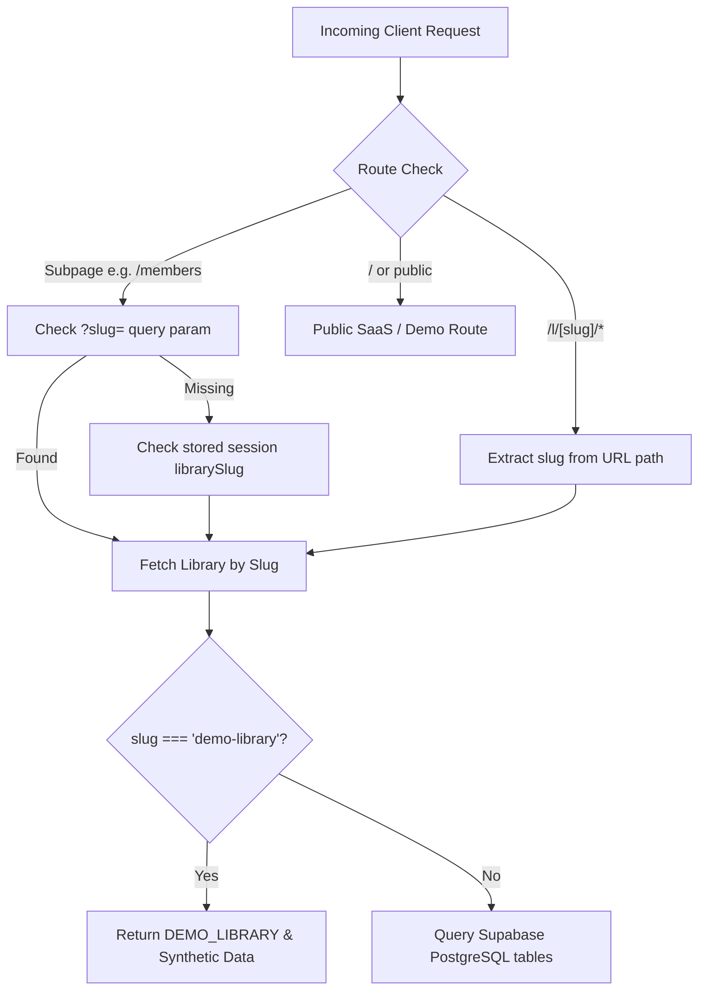

# 📐 LibraryOS — Architecture & Technical Specifications

This document outlines the multi-tenant architecture, data model, security boundary gates, and billing state machine implemented in **LibraryOS**.

---

## 🏢 Multi-Tenancy Resolution Model

LibraryOS employs a **hybrid tenant resolution strategy** ensuring that:
1. Every library gets a clean, shareable URL: `/l/[slug]`.
2. Reception subpages (`/members`, `/collections`, `/due-fees`, `/new-receipt`) preserve tenant context via URL query parameter (`?slug=[slug]`) and fall back to `sessionStorage`.
3. Marketing landing pages (`/`, `/login`, `/signup`) remain decoupled from specific libraries.



---

## 🚦 Subscription & Access Control State Machine

The access control engine (`lib/tenant.ts` -> `getLibraryAccessStatus`) evaluates tenant permissions on every route navigation:

```mermaid
stateDiagram-v2
    [*] --> 7DayTrial: New Library Created
    7DayTrial --> ActivePaid: Super Admin marks Paid (+30d)
    7DayTrial --> TrialExpired: 7 Days Elapsed without Payment
    TrialExpired --> ActivePaid: Fee Paid & Activated (+30d)
    ActivePaid --> PastDue: Subscription Period Ends
    PastDue --> ActivePaid: Renewal Payment (+30d)
    ActivePaid --> Suspended: Administrative Block
    TrialExpired --> Suspended: Administrative Block

    state 7DayTrial {
        DeskAccess: OPEN
        SettingsAccess: OPEN
        SuperAdminMRR: ₹0 (Free Trial)
    }

    state TrialExpired {
        DeskAccess: LOCKED behind TenantAccessBarrier
        SettingsAccess: LOCKED
        DataStatus: 100% PRESERVED
    }

    state ActivePaid {
        DeskAccess: OPEN
        SettingsAccess: OPEN
        SuperAdminMRR: ₹600/mo (Counted in Verified MRR)
    }
```

### Access Status Types (`LibraryAccessInfo`):
- **`trial`**: `isBlocked = false`. Top testing banner displayed with remaining day counter.
- **`trial_expired`**: `isBlocked = true`. Replaces workspace with `TenantAccessBarrier`. Data preservation guarantee displayed.
- **`active`**: `isBlocked = false`. Fully operational paid workspace.
- **`past_due`**: `isBlocked = true`. Subscription expired paywall displayed.
- **`suspended`**: `isBlocked = true`. Manual administrative block.

---

## 🛡️ Security Boundaries & Role Matrix

| Resource / Page | Public Student | Staff Desk | Library Owner | Super Admin |
| :--- | :---: | :---: | :---: | :---: |
| **SaaS Landing (`/`)** | ✅ | ✅ | ✅ | ✅ |
| **Demo Lounge (`/l/demo-library`)** | ✅ | ✅ | ✅ | ✅ |
| **Student Entrance QR (`/l/[slug]/join`)** | ✅ | ✅ | ✅ | ✅ |
| **Student Digital Pass (`/l/[slug]/student`)** | ✅ | ✅ | ✅ | ✅ |
| **Front Desk Seat Matrix (`/l/[slug]`)** | ❌ | ✅ | ✅ | ✅ |
| **Members & Due Fees Ledgers** | ❌ | ✅ | ✅ | ✅ |
| **Daily Collections** | ❌ | ✅ | ✅ | ✅ |
| **Owner Settings (`/l/[slug]/settings`)** | ❌ | ❌ | ✅ (Owner Passcode) | ✅ |
| **Soundbox UPI Config** | ❌ | ❌ | ✅ (Owner Passcode) | ✅ |
| **Staff Password Reset** | ❌ | ❌ | ✅ (Owner Passcode) | ✅ |
| **Founder Control Panel (`/superadmin`)** | ❌ | ❌ | ❌ | ✅ (Founder Master Key) |

---

## 🎨 Zero-Cloud-Cost White-Label Architecture

To ensure zero recurring infrastructure costs (eliminating external AWS S3, Cloudinary, or Supabase Storage bucket fees):
1. **Client-Side Compression**: An HTML5 Canvas pipeline compresses user-uploaded images to WebP (`quality: 0.82`, max dimensions `256x256`).
2. **Direct Column Storage**: Output is encoded into an ultra-compact Base64 data URI (`data:image/webp;base64,...`, `< 25KB`) and stored directly into PostgreSQL `libraries.logo_url TEXT`.
3. **Instant Monogram Fallback**: If no logo is uploaded, vector SVGs with 2-letter monograms or curated study crests are dynamically synthesized in memory with zero network latency.

---

## 📊 Super Admin Verified MRR Architecture

```typescript
// Verified MRR Calculation (app/superadmin/page.tsx)
const paidActiveLibs = libraries.filter((l) => {
  if (l.is_lifetime_fixed) return true;
  if (l.subscription_status === "active") {
    if (!l.subscription_ends_at) return true;
    return new Date(l.subscription_ends_at).getTime() > Date.now();
  }
  return false;
});

// Free trials contribute ₹0 to MRR
const verifiedMRR = paidActiveLibs.reduce((sum, l) => sum + (l.monthly_fee || 0), 0);
```

- **Target Library**: ₹400/month (Lifetime VIP Founding Client).
- **Trial Libraries**: ₹0/month until marked as paid by Super Admin.
- **Accurate Financials**: Prevents vanity metrics and accurately reflects real cash flow.
